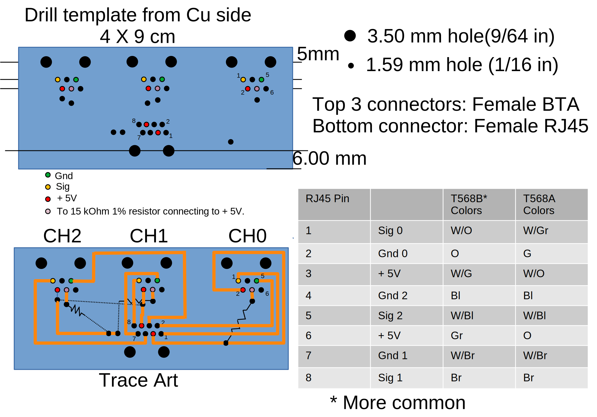

# Three Channel Adapter Board for Vernier Sensors
## Board plans

## Etching the board
Clean Cu cladding to be etched by wet sanding with 1500 grit or finer.
Draw traces with a black sharpie  “industrial super permanent ink” version
works best. Allow to dry completely (no odor). Can be speeded up using a heat
gun.

### Etchant recipe:
3 M HCl

CuCl2 to make medium emerald green solution (can also be made by 
dissolving Cu after adding hydrogen peroxide)

Using test piece add 30% H2O2 dropwise to get gentle 
bubbling and 
complete
removal in 3 – 5 min (longer gives poorly defined edges).