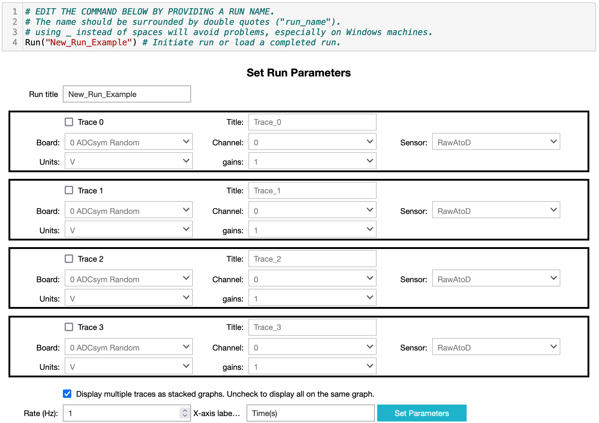

[Introduction](#introduction) | 
[Usage](#usage)
### Introduction
 This software allows realtime collection and plotting of 
digitized data in  a Jupyter notebook using either of the following two
interface boards on a Raspberry Pi:
* Adafruit compliant ADS1115 boards 
([example](https://www.amazon.com/KNACRO-4-Channel-Raspberry-ADS1115-Channel/dp/B07149WH7P),
also available from other vendors);
* The [&pi;-Plates DAQC2 plate](https://pi-plates.com/daqc2r1/). 
* A demo mode will run on any computer with a Jupyter notebook install and
Python 3.6+. You can try the demo mode without installing on your own 
  computer by launching an instance on the MyBinder servers:
.
 Example notebooks can be found in the "usage_examples" folder.

### Usage
[Launch the software](#starting-jupyterpidaq) | 
[Initialize data acquisiton tools](#initialize-the-data-acquisition-tools) | 
[Collect data](#collecting-data) |
[Displaying a Data Table](#in-a-table) | 
[Plotting data](#plotting-data) | 
[Analyzing data](#analyzing-data) 

#### Starting JupyterPiDAQ
A working Jupyter notebook installation with JupyterPiDAQ installed is
required. If you need to install the software see the [Installation 
Instructions](Installation.html). There are two common ways this may be set 
up, that lead to slightly different steps for starting the software:
1. __A special kernel__ may be set up that can be used in any Jupyter notebook 
   install for the current user (see the end of the
   [Installation instruction](Installation.html)). 
    1. In this case launch
   Jupyter, in which ever directory you want to work, using the 
   command: `jupyter notebook`.
    2. Open a new notebook and choose the kernel 
   for `JupyterPiDAQ`. The kernel name will depend upon what was chosen 
   during installation.
2. __Only for use within the directory structure of the virtual environment__ 
   that was set up for the software. 
    1. In this case you must navigate to the 
   directory of the virtual environment using the `cd` command before 
   starting the software.
    2. Then enter the virtual environment with the command `pipenv shell`. 
       This assumes you set up `pipenv` as described in the 
       [Installation instructions](Installation.html).
    3. Launch Jupyter using the command: `jupyter notebook`.
    4. Open a new python notebook.

#### Initialize the Data Acquisition Tools
Initialize the data acquisition tools by putting the statement `from 
jupyterpidaq.DAQinstance import *` into the first cell and clicking on the 
'Run' button. The package loads supporting packages (numpy, pandas, plotly,
etc...) and searches for compatible hardware. On a Raspberry Pi this takes a
number of seconds. If no compatible A-to-D boards are found, demo mode is used.
In demo mode the A-to-D board is simulated by a random number generator.

When setup is done a new menu appears at the end of the toolbar (figure 1).

**Figure 1**: The menu created once the data acquisition software is 
initialized.

The menu options insert jupyter widget based GUIs for starting a run,
displaying the data as tables or plots, or composing an expression to calculate
a new column in a DataFrame.

#### Collecting data
From the "DAQ Commands" menu select "Insert New Run After Selection..." or 
"Append New Run to End...". The first will insert and start the code to set up 
data collection for a run in the cell below the currently selected cell. 
The second will append this to the end of the notebook. This will generate 
a GUI that looks like the figure 2, below. Fill in the information to define 
what you wish to do (see below figure 2 for more details).

__Figure 2__: Image of the GUI for setting up a data collection run.
1. Give the run a title/name using the first textbox.
2. You can collect up to four (4) data traces at once. Two different data 
   traces can display the same analog-to-digital channel, but in different 
   units (e.g. you could record both the raw voltage and temperature from a 
   thermistor). Each trace is activated by selecting its checkbox.
3. Once a trace is activated you can give it a title and must select: the 
   data acquisition board, channel, sensor, units and gain from the 
   available drop-down menus.
4. Once all your traces are set up decide whether they should be displayed in 
   multiple stacked graphs or all on the same graph. Uncheck the box to 
   display all on one graph.
5. Select the data collection rate (3 Hz is currently the maximum rate).
6. When everything is set the way you wish, click on the "Set Parameters" 
   button. The collection parameters will be displayed and a button to 
   start the data collection will appear.
7. The "start" button will convert to a "stop" button once data collection 
   is started. The data graph(s) will update at roughly 1 Hz, so you can 
   monitor the progress of the data collection.
8. Click the "stop" button to end data collection. It can take 
   a while to stop if the data collection has got ahead of the graphic 
   display of the data.
9. Once collection is stopped you will see a plot or plots of the completed 
   data collection and the name of the .csv file the raw data has been 
   backed up to.

#### Displaying data

##### In a table
Selecting the "Show data in table..." option in the "DAQ Command" menu will 
insert a cell immediately below the currently selected cell displaying a 
widget in which you can select which data set to display.

##### Plotting data
Selecting the "Insert new plot after selection..." option in the menu will
insert two cells immediately below the currently selected cell. The first cell
will be used to generate a GUI to lead you through creation of the code to
generate the plot. The second cell is where the plot creation code is 
generated. The first tab of this GUI looks like figure 3.

**Figure 3**: Image of the first tab in the four tab (4 step) Pandas Plot 
Composer.

It is best to do the tabs in order. The notices in red will try to 
warn you of errors or oversights. The "Instructions" accordian can be 
expanded to get more specific information about how to use each tab.

You can get more sophisticated control of 
your plot by editing the code produced by this GUI. See the [Plotly 
FigureWidget Instructions](https://plotly.com/python/figurewidget/) and the 
example Jupyter notebooks referenced there for more information.

The GUI destroys itself once you complete step 4.

#### Analyzing data

##### Calculating a new column
Selecting "Calculate new column..." from the menu will add two cells
immediately below the selected cell. The first cell will create the GUI to
lead you through creation of the code to calculate the new column. The second
cell is where the code is built. The first tab of the GUI looks like figure 4.

**Figure 4**: Image of the first tab in the four tab (4 step) Pandas New 
Calculated Column Composer.

Do the tabs in order. You can perform more complex manipulations than built 
into the GUI by editing the code generated by this GUI.

The GUI destroys itself once you complete step 4.

##### Fitting data
There is not yet a menu item, but a GUI for defining fits (linear, 
polynomial, sine and Gaussian) is accessible by issuing the command 
`fit_pandas_GUI()` in an empty cell.

**Figure 5**: Image of the first tab in the Pandas Fit Composer.